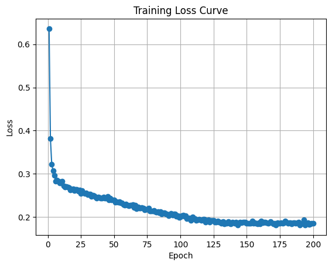
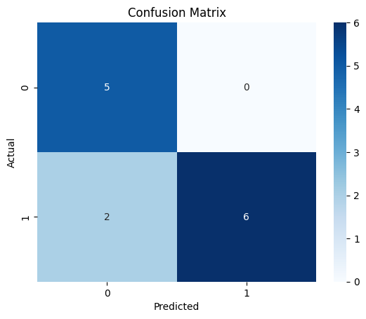

# AETransformerLite: Interpretable Gene Expression Classifier

---

## 목적

AETransformerLite는 기존 AutoEncoder(AE)의 비선형 차원 축소 능력과 Transformer의 Self-Attention 메커니즘을 결합하여, **비선형 유전자 상호작용의 해석 가능성 확보**를 목표로 합니다.

- 기존 AE 구조는 분류 성능은 우수했으나 해석력 부족
- FN(False Negative) 케이스에서 유전자 중요도를 도출하여 **새로운 생물학적 통찰** 확보

---

## 데이터 특성 및 전처리

- **입력 데이터**: GSE16561 마이크로어레이(RNA microarray)
- **샘플 수**: 약 60개 (소규모)
- **유전자 수 (Feature 수)**: 약 18,000개 (고차원)
- **라벨 처리**: `Unnamed: 0` 열에서 `SampleID` 및 `Label`(0/1) 분리
- **결측값**: 없음
- **데이터 형식**: `X.values (float)`, `y.values (0/1)`

> 고차원-저샘플 구조는 “차원의 저주(curse of dimensionality)” 문제를 야기할 수 있음

---

## 모델 구조: AE + Self-Attention

AE + Transformer는 다음 세 가지 조건을 동시에 만족하기 위해 설계:

- 소규모 샘플
- 고차원 유전자 feature
- 해석 가능성 확보

### 1. **Encoder (AE part)**
```
nn.Linear(input_dim, 64) → ReLU → nn.Linear(64, latent_dim)
```
[역할]
- 18,000개 유전자 → 8차원 latent vector로 축소
- 중간 64차원은 정보 손실 방지
- ReLU 활성화로 비선형 압축
  
[설계 의도]
- 소규모 샘플 수(60)와 다수의 차원(18,000)으로 인한 차원의 저주를 극복
- 단순 PCA와 달리 ReLU 활성화 함수를 통해 비선형 변환을 수행하여 정보 손실을 최소화합니다

### 2. Embedding for Transformer
```
x = latent.unsqueeze(2)
x = self.embedding(x)  # Linear(1 → tf_embed_dim)
```
[역할]
- latent 차원을 Transformer가 처리 가능한 시퀀스로 변환
- latent 각 차원을 token처럼 처리하여 attention 적용
  
[설계 의도]
- Transformer는 기본적으로 시퀀스 처리 구조를 가짐, 각 잠재 차원을 동일한 임베딩 공간으로 투사(Linear(1 → tf_embed_dim))하여 잠재 차원 간의 상관관계를 토큰 관계로 해석할 수 있도록 함

### 3. Self-Attention (Transformer Core)
```
nn.MultiheadAttention(embed_dim=tf_embed_dim, num_heads=1)
```
[역할]
- token 간 상호작용 학습
- attention weight matrix (L × L) 추출 가능 → 해석 가능
- head 수를 1로 고정하여 소규모 데이터에서 노이즈 최소화
  
[설계 의도]
- num_heads=1로 설정하여 소규모 데이터에서 어텐션 헤드가 많을 때 발생할 수 있는 노이즈 유입을 줄임
- 추출된 어텐션 가중치는 FN 환자의 피처 해석에 직접 활용되어 설명 가능한 AI를 구현

### 4. Global Average Pooling
```
x = attn_out.mean(dim=1)
```
[역할]
- Transformer 출력 시퀀스를 하나의 vector로 요약 (전체 latent 차원의 전반적 요약 벡터 생성)
- CLS 토큰 대신 mean pooling → 구조 간소화

[설계 의도]
- 잠재 차원의 길이가 작으므로 풀링으로 인한 정보 손실이 적음
  
### 5. Classifier
```
LayerNorm → Linear → Sigmoid
```
[역할]
- 풀링된 representation을 이진 분류로 변환
- LayerNorm으로 small batch 학습 안정성 향상
- Sigmoid 출력으로 Stroke vs Normal 분류

[설계 의도]
- 과적합 방지를 위해 단순 선형 분류기를 구성
  
### 6. Attention 저장
```
self.attn_weights = attn_weights.detach().cpu()
```
[역할]
- 해석 가능성 확보 핵심
- latent 간 상호작용 정보 저장
- encoder weight와 결합하여 gene-level 중요도 도출 가능

> attn_weights와 encoder.weight를 곱해 유전자별 중요도 점수 추출

---

## 학습 곡선

---

### 테스트셋 기준 성능
| Metric      | Value  |
| ----------- | ------ |
| Accuracy    | 0.8462 |
| Precision   | 1.0000 |
| Recall      | 0.7500 |
| Specificity | 1.0000 |
| F1 Score    | 0.8571 |
| AUC         | 0.9500 |



---

### 비교 분석: 기존 DEG 해석 vs FN 해석

## 1. FN 사례
| 유전자   | FN1 중요도 | FN11 중요도 |
| ----- | ------- | -------- |
| ABCA1 | 0.0897  | 0.0868   |
| ABCB9 | 0.0850  | 0.0896   |
| AAA1  | 0.0858  | 0.0856   |
| AACS  | 0.0848  | 0.0861   |
| ABCA3 | 0.0819  | 0.0838   |

- 반복 등장하는 유전자: ABCA1, ABCB9, ABCA3
- 지질 수송, 세포막 대사 관련 기능

## 2. 기존 DEG와의 비교
| 항목     | 기존 기능 해석 (DEG 기반)        | 본 모델 FN 해석               |
| ------ | ------------------------ | ------------------------ |
| 주요 기전  | 면역, 염증, 항체, 사이토카인        | 지질 수송, 막 단백질, 대사 조절      |
| 대표 유전자 | ARG1, CD6, MMP9, S100A12 | ABCA1, ABCB9, AACS, AATF |
| 공통점    | 일부 세포막 수송 기전 포함          | ABCA1: 염증 및 지질 대사 관련     |
| 핵심 차이점 | 면역 반응 경로 중심              | **새로운 대사 중심 서브타입 가능성**   |

- 모델 예측 오류(FN)가 단순 misclassification이 아니라 hidden subtype 탐색 실마리가 될 수 있음

---
### 결론 및 의의
- 예측 성능 확보: 85% 정확도, 0.95 AUC
- 해석 가능성 확보: attention 기반 유전자 중요도 분석
- 경량 구조 채택: 복잡한 구조 없이 효과적인 Self-Attention 구현

> 기존 DEG 기반 면역 중심 해석과는 다른 생물학적 해석 축을 제시
>
> 반복 등장 유전자들은 지질 수송/세포막 안정성과 관련됨
>
> 이는 잠재적 바이오마커 후보로서의 가치를 시사

---
### 한계 및 확장성
- 현재는 latent 수준의 attention만 해석 가능
- 향후 유전자 단위(Gene-wise) Transformer 구조로 확장 필요

> 더 많은 케이스 확보 시:
> 
> Bayesian Transformer, Graph Neural Network (GNN) 연동 등도 가능성 있음


